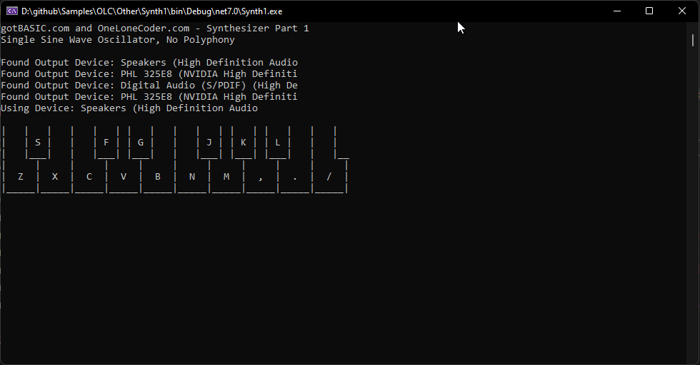
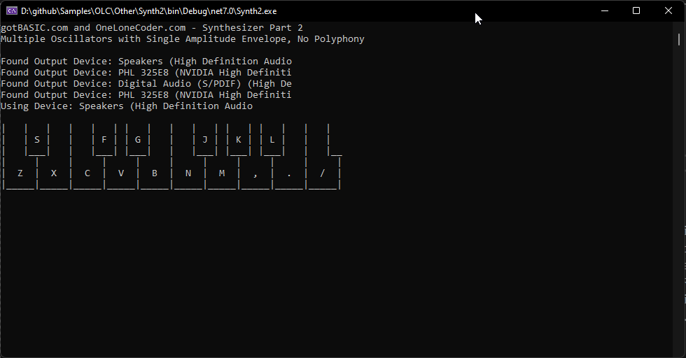
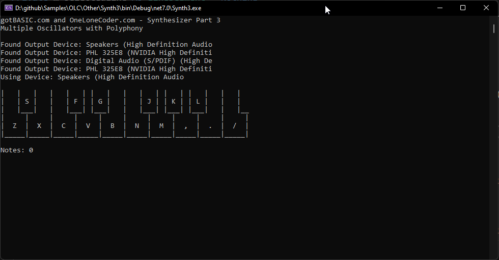
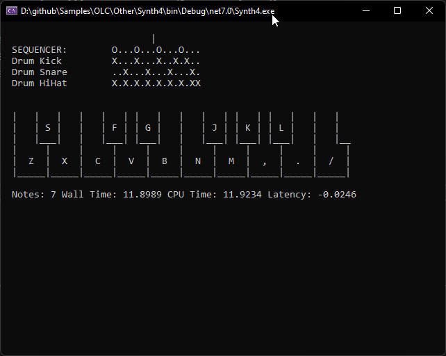
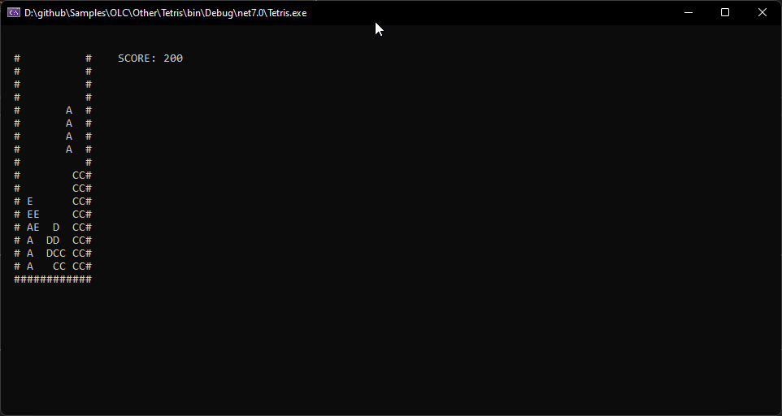
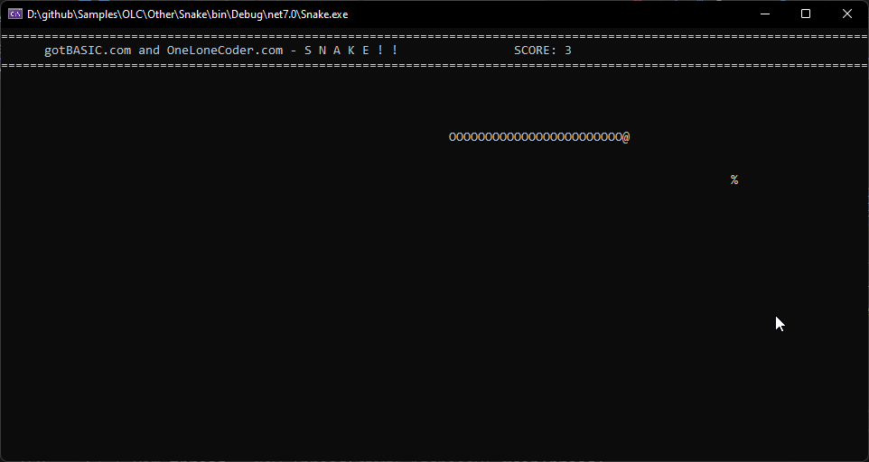

# One Lone Coder - Other

These examples are, for the most part, pre-olcConsoleGameEngine.

## Sound Synthesizer Part 1 - Waveforms

## Sound Synthesizer Part 2 - Oscillators & Envelopes

## Sound Synthesizer Part 3 - Instruments & Polyphony

## Sound Synthesizer Part 4 - WaveOut API & Sequencing

## FIRST PERSON SHOOTER... on the command line?

(todo)

## TETRIS From Scratch

## SNAKE From Scratch

